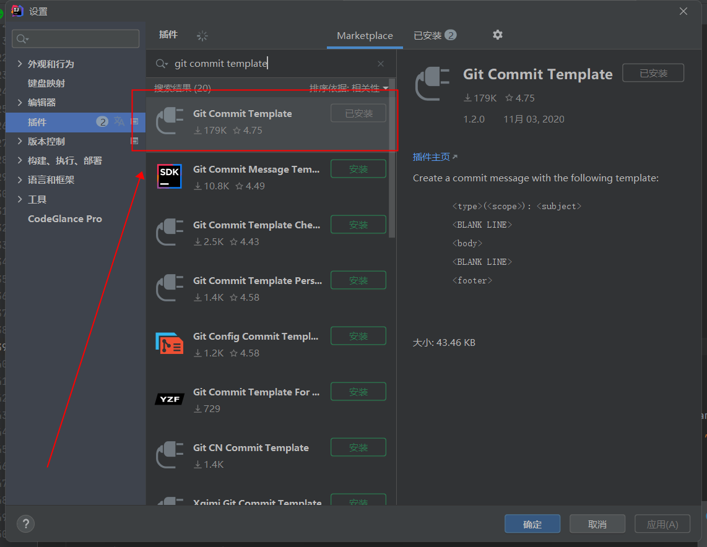
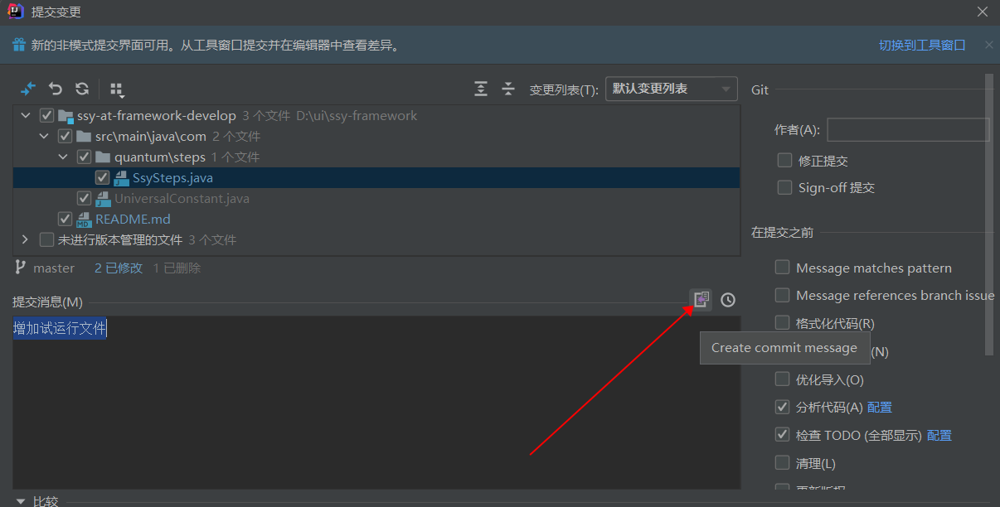
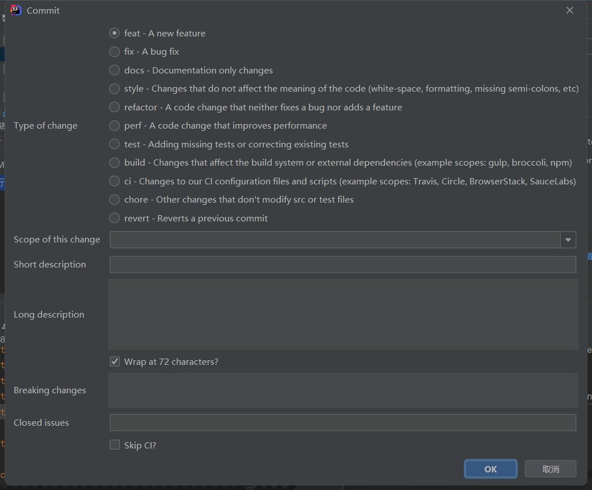
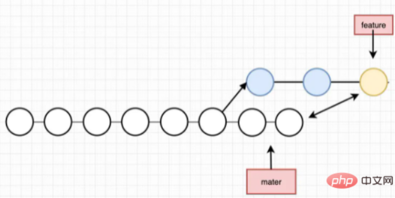
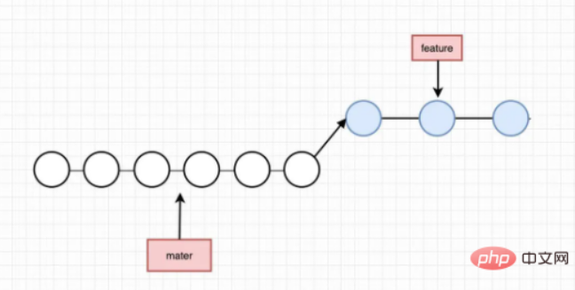

## 版本控制可以做什么

> 1.版本管理，避免版本管理混乱。这是使用版本管理的最主要原因，也是版本管理的目的所在。你肯定不会希望在本地手动备份了多个副本后，到头来却不知道那个备份是最新的，那个备份进行了什么修改，修改日期是什么时候等等一切你记不清的问题。而版本管理软件能解决这些问题，它有详细的日志，能记住你的每一次提交、每一次改动，并且能够比较查看不同版本之间的异同，并且可以恢复到之前的任一版本。  
> 2.提高代码质量。在没有版本管理之前，可能经常要在代码里写些不相关的注释，比如：某人某日对某代码进行修改；或是将一些不确定是否使用的代码用注释的形式保留等等,这些也就是僵尸代码啦。现在这些工作都可以交由版本管理工具完成，把这些不相关的僵尸代码从代码里删掉吧。  
> 3.提高协同、多人开发时的效率。及时提交更新代码，能让团队中的成员了解到代码的最新情况，避免重复劳动。  
> 4.明确分工责任。什么时候谁对代码做了修改、修改了什么内容，版本管理都会记录在案，方便查询，追究责任。  
> 5.除了代码以外，很多文档、个人资料，如：简历等等都可以进行版本管理，这是有趣而高效的。凡是需要持续修改的文档资料都可以进行版本管理。

### 语义化版本管理

版本格式：主版本号.次版本号.修订号，版本号递增规则如下：  
x.y.z

> x: 主版本号：当你做了不兼容的 API 修改，  
> y: 次版本号：当你做了向下兼容的功能性新增，  
> z: 修订号：当你做了向下兼容的问题修正。

先行版本号及版本编译信息可以加到“主版本号.次版本号.修订号”的后面，作为延伸。

### 提交模板

| 类型 | 意义 |
| --- | --- |
| feat | 功能feature的意思，也是最常用的。当你的功能有变更的时候，都可以采用这种类型的type |
| fix | 当然指的是bug修复 |
| docs | 更新了文档，或者更新了注释 |
| style | 代码格式调整，比如执行了format、更改了tab显示等 |
| refactor | 重构代码。指的是代码结构的调整，比如使用了一些设计模式重新组织了代码 |
| perf | 对项目或者模块进行了性能优化。比如一些jvm的参数改动，把stringbuffer改为stringbuilder等 |
| test | 这个简单，就是增加了单元测试和自动化相关的代码 |
| build | 影响编译的一些更改，比如更改了maven插件、增加了npm的过程等 |
| ci | 持续集成方面的更改。现在有些build系统喜欢把ci功能使用yml描述。如有这种更改，建议使用ci |
| chore | 其他改动。比如一些注释修改或者文件清理。不影响src和test代码文件的，都可以放在这里 |
| revert | 回滚了一些前面的代码 |

### 相关插件

IDEA中可以安装插件 `Git Commit Template` `File->Setting->Plugs` 搜索插件`git commit template`并安装 （PS：**[点我下载插件](https://plugins.jetbrains.com/plugin/9861-git-commit-template/versions)**）  在提交代码时，使用插件来创建一个提交信息  

## ✅ 推送代码

通常情况下，一个项目都是由多个开发者共同维护的，在你推送自己的代码时，可能已经有其他人提交或者删除过一些文件

## ✅ 解决冲突

## ✅ merge 的缺点

> 1.基线混乱，不利于维护  
> 2.无限循环，每处理一次冲突都会产生一个新的commit

## ✅ 什么是rebase

## ✅ rebase 和 merge 的区别？

> 1.rebase把当前的commit放到公共分支的最后面，merge把当前的commit和公共分支合并在一起。  
> 2.用merge命令解决完冲突后会产生一个commit，而用rebase命令解决完冲突后不会产生额外的commit。

**merge**的日志

  
**rebase**的日志

### ? 对遗留不规范提交的处理
