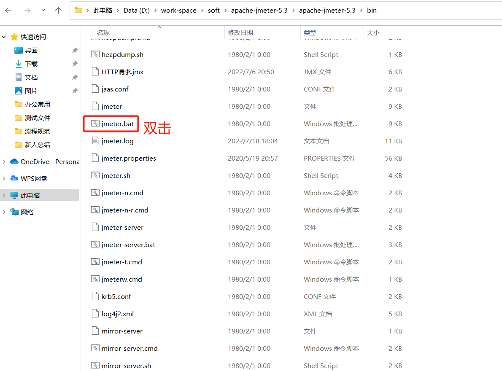
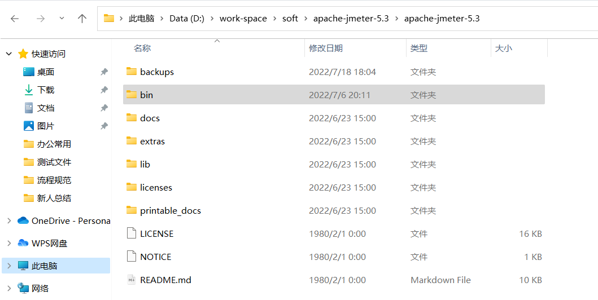
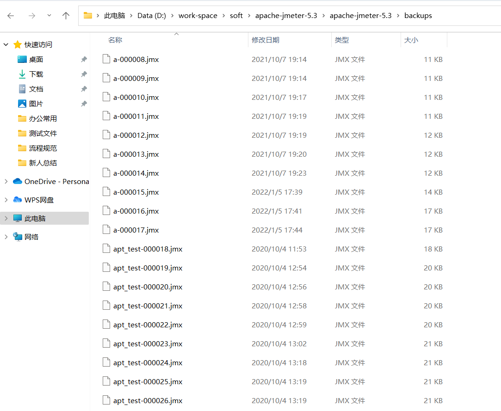
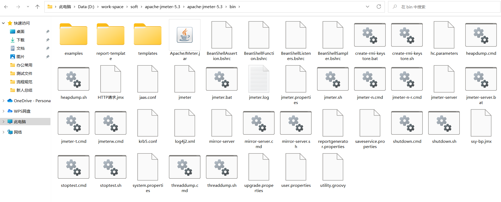
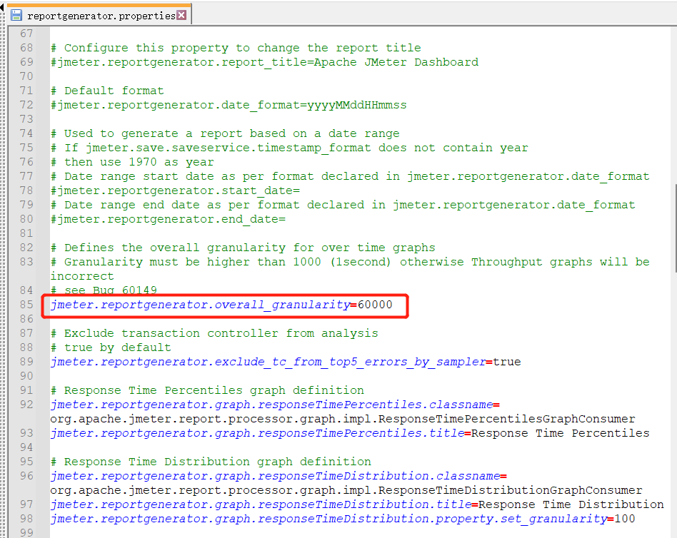

## JMeter 介绍

Apache JMeter是100%纯JAVA桌面应用程序，被设计为用于测试客户端/服务端结构的软件(例如web应用程序)。它可以用来测试静态和动态资源的性能，例如：静态文件，Java Servlet,CGI Scripts,Java Object,数据库和FTP服务器等等。JMeter可用于模拟大量负载来测试一台服务器，网络或者对象的健壮性或者分析不同负载下的整体性能。 同时，JMeter可以帮助你对你的应用程序进行回归测试。通过你创建的测试脚本和assertions来验证你的程序返回了所期待的值。为了更高的适应性，JMeter允许调用二次开发的jar包来丰富你的测试场景；JMeter允许你使用正则表达式来创建这些assertions.

## JMeter与LoadRunner比较

JMeter 是一款开源(有着典型开源工具特点：界面不美观)测试工具，虽然与LoadRunner相比有很多不足，比如：它结果分析能力没有LoadRunner详细；很它的优点也有很多：

开源，他是一款开源的免费软件，使用它你不需要支付任何费用， 小巧，相比LR的庞大（最新LR11将近4GB），它非常小巧，不需要安装，但需要JDK环境，因为它是使用java开发的工具。 功能强大，jmeter设计之初只是一个简单的web性能测试工具，但经过不段的更新扩展，现在可以完成数据库、FTP、LDAP、WebService等方面的测试。因为它的开源性，当然你也可以根据自己的需求扩展它的功能。扩展性极强。它可以测试性能，可以测试接口，甚至可以通过加载浏览器驱动完成UI自动化的工作！ 两者最大的区别：jmeter不支持IP欺骗，而LR支持。

从上边来看Jmeter是好处多多的，但是任何事、任何物都违背不了一个法则，那就是“金无足赤人无完人”，Jmeter也是有不足之处的，下边我们来看看Jmeter的不足之处，这里宏哥就不深究它到底是娘胎里带来的还是后天造成的了，一般对于软件来说都是娘胎里带来的，先天不足。原因是：开发的时候可能由于某些原因考虑不足，导致其娘胎里带病。

## JMeter缺点

使用JMeter无法验证JS程序，也无法验证页面UI，所以要须要和Selenium配合来完成Web2.0应用的测试。

## 下载安装

### JMeter安装

1. [http://jmeter.apache.org/下载最新版本的JMeter，解压文件到任意目录](http://jmeter.apache.org/%E4%B8%8B%E8%BD%BD%E6%9C%80%E6%96%B0%E7%89%88%E6%9C%AC%E7%9A%84JMeter%EF%BC%8C%E8%A7%A3%E5%8E%8B%E6%96%87%E4%BB%B6%E5%88%B0%E4%BB%BB%E6%84%8F%E7%9B%AE%E5%BD%95)
    
2. 安装JDK，配置环境变量JAVA\_HOME
    

JDK环境变量配置传送门

3. 系统要求：JMeter2.11 需要JDK1.6以上的版本支持运行
    
4. JMeter可以运行在如下操作系统上：Unix，Windows和Open VMS.
    
5. 应当避免jdk路径与jmeter路径有中文和空格，否则会有异常,也会导致远程测试出现问题。
    

### JMeter插件安装（正常压测中不推荐使用，仅供学习）

1. 插件下载地址： [http://jmeter-plugins.org/downloads/all/](http://jmeter-plugins.org/downloads/all/)
    
2. 插件下载后解压：找到JMeterPlugins-Extras.jar,把JMeterPlugins-Extras.jar放到apache-jmeter-2.12\\lib\\ext目录。
    

## JMeter运行

### JMeter启动的两种姿势

#### 启动姿势1（推荐使用）

进入bin目录，双击运行jmeter.bat启动jmeter

注意：打开的时候会有两个窗口，JMeter的命令窗口和JMeter的图形操作界面，不可以关闭命令窗口。



#### 启动姿势2

进入bin目录，双击ApacheJmeter.jar包运行

注意：打开的时候会有只有一个窗口，JMeter的图形操作界面，和上边的不一样哈。


## JMeter目录结构解析

### 根目录

Jmeter安装包解压后的根目录如下图：



### 根目录说明（由上到下）

1. backups目录 脚本备份目录，里边的文件都是以.jmx后缀结尾的文件 实际开始安装解压后是不存在这个目录的，这个是由于宏哥使用过JMeter后，JMeter自动创建这个目录，然后备份了脚本文件。
    
2. bin目录 可执行文件目录 Jmeter.bat：是启动jmeter的主脚本。 Jmeter-server.bar：是用来实现联机负载。 Jmeter.properties：是jmeter主要的配置文件，超过80%的配置项都是通过这个文件实现。（PS：修改配置文件后，要重启Jmeter才能生效） Jmeter.bat 打开Jmeter主界面 Jmeter使用的日志文件名称被定义到Jmeter.properties中，默认在Jmeter.log可查看日志
    
3. docs目录 docs目录下的文件是JMeter的Java Docs,而printable\_docs的usermanual子目录下的内容是JMeter的用户手册文档，其中component\_reference.html是最常用到的核心元件帮助文档。该目录下存放的是jmeter官方文档的API文档，主要是用于二次开发。
    
4. extras目录 该目录下的文件提供了对构建工具Ant的支持，可以使用Ant来实现测试自动化，例如批量脚本执行，产生HTML格式的报表，测试运行时，可以把测试数据记录下来，Jmeter会自动生成一个.jtl文件，将该文件放到extras目录下，运行“ant -Dtest=文件名 report”，就可以生成测试统计报表。也可以用于持续集成。
    
5. lib目录 该目录包含两个子目录，其中ext子目录存放有JMeter的核心jar包，另一个junit子目录存放JUnit测试脚本。用户扩展所依赖的包，应该直接放到lib目录下，而非lib/ext下。 注意：无法识别 zip 格式的包文件，所以需要的包文件均要求以 .jar 结尾
    
6. licenses jmeter软件许可文件目录
    
7. printable\_docs目录 该目录存放的是jmeter官方提供的帮助文档。printable\_docs的demos子目录下有一些常用的JMeter脚本案例，可以作为参考。可打印半版本目录。
    
8. LICENSE JMeter许可说明
    
9. NOTICE JMeter简单信息说明
    
10. [README.md](http://readme.md/) JMeter官方基本介绍
    

## backups内容

backups下面都是jmeter编写脚本的备份文件



## bin内容



examples：目录下包含Jmeter使用实例，打开里面是一个csv样例

ApacheJMeter.jar：JMeter源码包

jmeter.bat：windows的启动文件

jmeter.log：Jmeter运行日志文件

[jmeter.sh](http://jmeter.sh/)：linux的启动文件

jmeter.properties：系统配置文件

jmeter-server.bat：windows分布式测试要用到的服务器，启动负载生成器服务文件

jmeter-server：Linux下启动负载生成器文件

shutdown.cmd windows 下 jmeter 关闭文件

stoptest.cmd windows 下 jmeter 测试停止文件

## docs内容

api：api文件以及css和图像样式


## lib内容

此文件夹里面全是一些jar包 

## JMeter主要配置文件

### jmeter.properties配置文件

jmeter.properties，定义jmeter运行的关键配置；下边宏哥列举了一下这个文件的关键配置如下： #默认语言设置

```
  language=en
```

#捕捉cookie开关

```
  CookieManager.save.cookies=true
```

#配置编辑器的字体和尺寸

```
 jsyntaxtextarea.font.family=宋体

 jsyntaxtextarea.font.size=20
```

#配置默认编码格式

```
 sampleresult.default.encoding=UTF-8
```

#SSL 配置：重点关注下面几个配置# 指定 HTTPS 协议层 # 指定 HTTPS 协议层 https.default.protocol=TLS # 指定 SSL 版本，实际应用中可能需要修改 https.default.protocol=SSLv3 # 设置启动的协议 https.socket.protocols=SSLv2Hello SSLv3 TLSv1 # 缓存控制，控制 SSL 是否可以在多个迭代中重用 https.use.cached.ssl.context=true

#JMeter 测试项目自动备份配置 # 设置是否启用自动备份，默认是 true jmeter.gui.action.save.backup\_on\_save=true # 设置自动备份目录，默认备份至 JMeter 根目录的 backups下 jmeter.gui.action.save.backup\_directory= # 设置自动备份项目数，默认为最近 10 个 jmeter.gui.action.save.keep\_backup\_max\_count=10

#远程主机配置 # 配置远程主机的 IP，默认为本机。用逗号","可以设置多个远程主机 remote\_hosts=127.0.0.1 # 多个远程主机指定示例如下,其中:后为端口 remote\_hosts=127.0.0.1:1099,127.0.0.1:1200,127.0.0.1:1300 对于 RMID 的配置请直接看配置文件中的选项说明

#日志管理配置 # 设置日志格式 log\_format\_type=default # 设置日志输出级别 log\_level.jmeter=INFO # 设置 junit 日志输出级别 log\_level.jmeter.junit=DEBUG # 设置日志输出目标文件，默认为 jmeter.log log\_file=jmeter.log

## jmeter.bat 关键配置修改

#为了更优化的使用 jmeter，需要对 jmeter.bat 中的一些配置根据当前机器的配置进行优化，这里进行关键配置项说明，大家根据自己的机器的配置来进行修改。jvm 相关配置，大概在 80 行左右，找到这些配置，对其中的数值根据当前机器的硬件配置来修改。 set HEAP=-Xms2048m -Xmx2048m set NEW=-XX:NewSize=512m -XX:MaxNewSize=512m set SURVIVOR=-XX:SurvivorRatio=8 -XX:TargetSurvivorRatio=50% set TENURING=-XX:MaxTenuringThreshold=2 if %current\_minor% LEQ “8” ( rem Increase MaxPermSize if you use a lot of Javascript in your Test Plan : set PERM=-XX:PermSize=512m -XX:MaxPermSize=1024m)

# 设置输出报告模板格式

```
 jmeter.save.saveservice.output_format = csv
```

## system.properties配置文件

system.properties，定义Java进程的系统变量，通过System.getProperties()可查询。

## user.properties配置文件

user.properties，自定义配置，可覆盖jmeter.properties。

## 拓展

1. 配置文件可能存在优先级关系，好像user.properties会覆盖jmeter.properties，一般修改配置都是修改或者添加user.properties，不建议修改jmeter.properties
    
2. 通过修改reportgenerator.properties的下面配置，可以减少采样时间，增加采样精度。生成的报告的其他内容也可以在这里修改。当然，建议这些修改，都放到user.properties里面去
    



3. 修改jmeter.properties里的这些配置，可以控制报告DashBoard的显示时间，建议这些配置放到user.properties里面去
