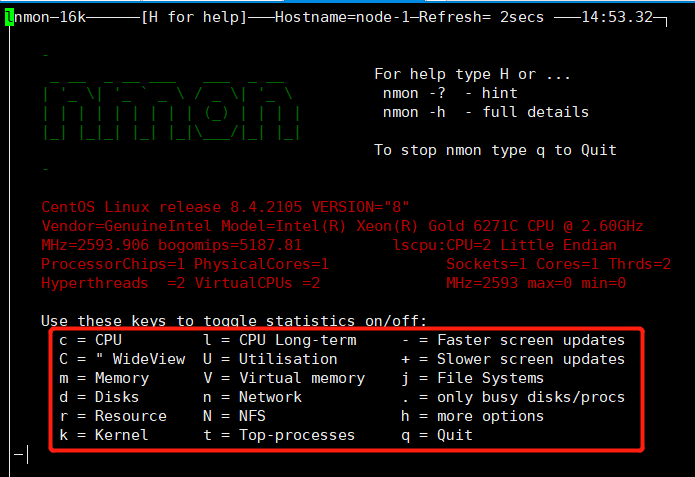
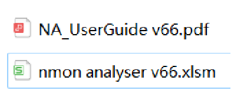
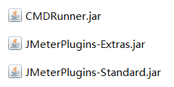
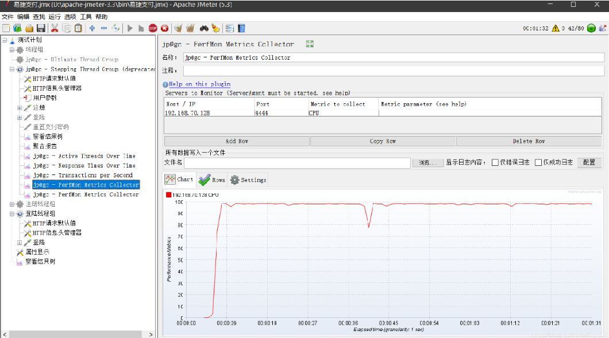
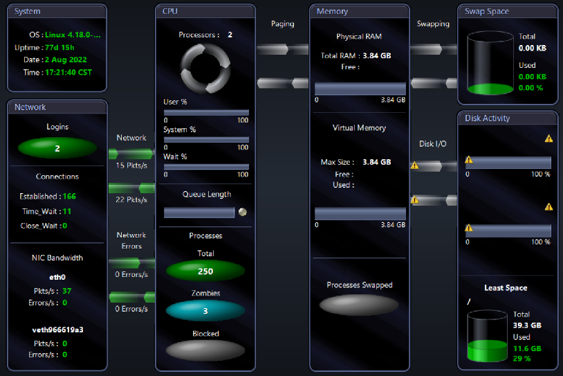
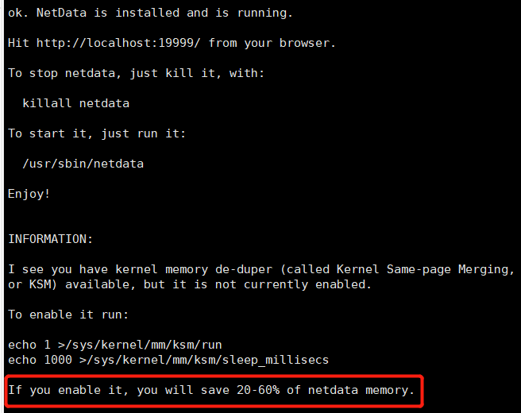
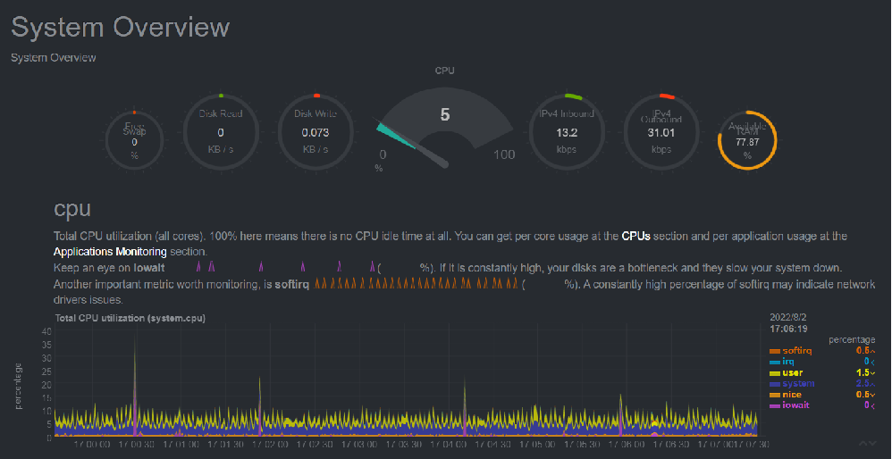

# 常用监控工具介绍

## nmon监控工具

### nmon安装

nmon的两种安装方式： 1. yum install -y nmon （推荐） 2. 直接下载nmon然后启动使用 mkdir nmon chmod 777 nmon cd nmon wget http://sourceforge.net/projects/nmon/files/nmon16e\_mpginc.tar.gz tar -zxvf nmon16e\_mpginc.tar.gz ./nmon\_x86\_64\_centos7

### nmon介绍

#### 监控模式

1. 只能监控linux
    
2. nmon有三种运行模式
    

\- 实时屏幕交互模式：  
执行nmon运行命令、快捷键cmdn

- 数据收集模式  
    用的最多的命令，后面-f , 默认收集24小时，结果输出到 .nmon文件
- 定时执行模式  
    每隔30秒收集一次数据，总共收集120次，即1小时就自动退出

#### nmon记录数据

- CPU占用率
- 内存使用情况
- 磁盘I/O速度，传输和读写比率
- 文件系统的使用率
- 网络I/O速度，传输和读写比率，错误统计率与传输包的大小
- 消耗资源最多的进程
- 计算机详细信息和资源
- 页面空间和页面I/O速度
- 用户自定义的磁盘组
- 网络文件系统

#### nmon实时屏幕交互



键盘直接输入对应的字母，可以显示相应的监控数据

#### nmon常用参数

- c 查看CPU相关信息
- m 查看内存相关信息
- d 查看磁盘相关信息
- n 查看网络相关信息
- t 查看相关进程信息
- h 查看帮助相关信息

#### nmon常用命令

nmon -ft -s 10 -c 60 -m ./ 采集信息并保存在当前目录下，会生成一个机器名_日期_时间的结果

##### 参数说明

\-f 监控结果以文件形式输出，默认机器名+日期.nmon格式 -F 指定输出的文件名，比如test.nmon -s 指的是采样的频率，单位为秒 -c 指的是采样的次数，即以上面的采样频率采集多少次 -m 指定生成的文件目录 -t 输出最耗资源的进程

#### nmon结果查看

nmon结果查看，需要下载nmon\_analyser https://sourceforge.net/projects/nmon/files/nmon\_analyser\_v66.zip/download



注意：如果是稳定性测试，不建议连续使用nmon，因为一个文件过大时会失败。或者可以采取执行半小时，然后重新执行换一个文件的方式

## ServerAgent监控

jmeter的一个监控插件(不推荐使用，会导致压测结果不准)

把下面3个jar包，放到\[jmeter\]\\lib\\ext



把ServerAgent上传到应用服务器进行数据采集，然后启动./startAgent.sh



## Spotlight on监控

注意：用户名不能使用root连接，需要自己创建个用户root权限的用户（在目标服务器执行下面的命令）

1. useradd test
2. passwd test
3. vim /etc/passwd(可以忽略)
4. 将test用户的UID和GID改成0:0(可以忽略)
5. 安装：yum install -y sysstat



## Netdata监控

### 安装依赖

```
yum install -y  gcc make autoconf automake pkg-config
cd /usr/local/src
wget  http://www.zlib.net/zlib-1.2.12.tar.gz
tar -zxvf  zlib-1.2.12.tar.gz
cd zlib-1.2.12/
./configure
make
make install
```

### 安装netdata

```
cd /usr/local/src/
wget http://firehol.org/download/netdata/releases/v1.0.0/netdata-1.0.0.tar.gz
tar -xf netdata-1.0.0.tar.gz
cd netdata-1.0.0
./netdata-installer.sh  （多数会报错，可以直接使用下面的命令安装）
./netdata-installer.sh  --zlib-is-really-here
```

### 安装成功



netdata 是安装成功后就开始监控，资源消耗毕竟高，不推荐使用

### 监控页面


