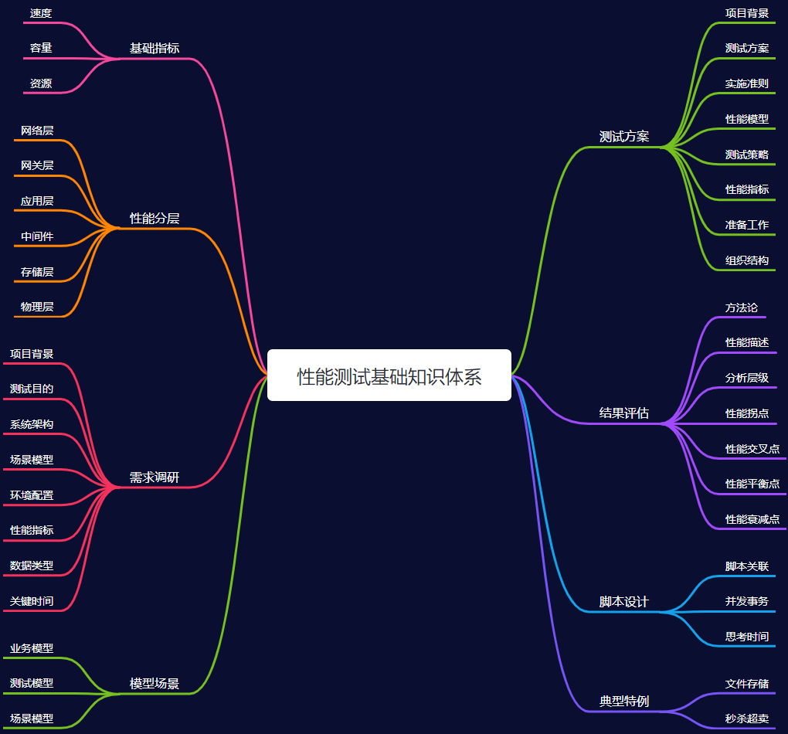

# 性能测试基本知识点

谈起性能测试，大家经常聊的是高并发、高可用、性能优化、全链路压测等，听起来都挺高大上，但这些概念追本溯源，还是要落到性能测试基础的东西上。

比如需求分析、场景建模、测试方案、性能分层、指标监控、结果评估和优化建议本身上面。

## 思维导图

## 知识体系

### 基础指标

简单来说，性能测试实际上主要关注如下三点：

速度：RT ；

容量：吞吐量(TPS)；

资源：CPU、Memory、DiskIO、Network、文件句柄数；

### 性能分层

性能测试领域，要在评估调研阶段就考虑性能分层的影响。在性能分析和优化阶段，也要考虑不同层级对整体性能的影响。我将它们分为如下六层：

网络层：主要指带宽、网段、防火墙等设施，当然，CND之类的资源，也可以划分在这一领域；

网关层：网关是请求入口和业务接入层，一般登录验签调用、加解密鉴权、限流等操作，都是在网关进行；

应用层：无论是前端的渲染展示还是后端的逻辑处理，都可以理解为应用层；

中间件：中间件包含缓存、MQ、JOB、DTS/DRC/DAL、配置中心等一系列组件；

存储层：一般指数据存储和文件存储层级，典型的组件有MySQL、HDFS；

物理层： 无论是云服务还是自建机房，物理硬件层面都可以归纳到这一层；

### 需求调研

项目背景：版本迭代&独立项目&新建服务&系统重构&性能优化；

测试目的：超卖&高并发&扩容性&配置验证&资源耗用；

#### 系统架构

技术架构：服务间的依赖关系，包含缓存，MQ等信息；

网络拓扑：请求-域名-SLB/HA/Nginx-web-app-DB以及外部依赖；

#### 场景模型

业务场景：业务场景的多样性和特殊性以及对脚本开发联调&数据预埋的影响；

业务模型：只读、读写、批处理、定时Job；

业务配比：被测场景占总体场景的业务量占比（公式：被测场景/总业务量\*100%）

选取业务峰值的数据，单独统计；

如果各业务占比类似，则按照比例转化；

如果比例差距大，则按照区间单独统计分析；

环境配置：app&Redis&MQ&DB&网络&网段&&带宽&防火墙，是否独享资源隔离等；

#### 性能指标

业务指标：DAU、GMV、注册用户数、在线用户数、活跃用户数、增长趋势等；

系统指标：协议类型、长短链接、同步策略、加解密、JVM内存分配、容器线程数&连接数&Timeout、MQ-Cousumer数量；

压测指标：TPS、99%RT、Success%、并发数、资源利用率；

#### 数据类型

基础数据量；

每个月增量数据的量（提前做好增量数据规划，一般在增量数据的基础上再增加10%~30%的量）；

是否有敏感数据需脱敏；

限制条件(时间&次数&权限)；

自增、唯一、UUID、加解密、幂等；

关键时间：提测时间、验收时间、上线时间；

### 模型场景

业务模型：业务场景、流量转化漏斗；

测试模型：关注核心场景，过滤无关及非核心业务；

场景模型：从系统架构设计层面出发，关注不同层面，提升性能！

基准：单机单服务单接口；

并发：设定阈值，观察水位；

容量：阶梯式加压、性能拐点、资源瓶颈；

异常：容错处理、监控告警、容灾恢复演练；

稳定性：长期稳定正确提供服务的能力，可用性SLA；

### 测试方案

项目背景：说明项目开展的背景及目的；

测试方案：针对项目涉及的场景，测试实施的大体方案；

实施准则：任何项目，都要有准入准出和暂停中止准则；

性能模型：针对具体的场景，设计的性能模型最好经过评估验证；

测试策略：针对测试模型所采用的不同的测试策略，同步的测试策略要达成什么样的目的；

性能指标：业务指标是多少？转化的技术指标是多少？冗余范围有多大？

准备工作：其中包含环境、数据、脚本、监控等准备事项；

组织结构：整个项目中涉及哪些事项？不同事项的负责人是谁？交付时间是什么时候？

### 结果评估

在性能测试实施过程中，准确定义和描述性能测试结果，及针对不同结果进行模型分析，是很重要的一项能力。

性能实施方法论

基于指标构建；

建模是分析的过程和结果；

基于真实环境的系统模拟；

压测实施过程是整体的核心；

需要设定统一的目标、流程、分析方法、组织结构；

正确描述性能结果和过程的术语

瓶颈描述：什么场景执行了什么策略/操作，因为什么原因导致了什么结果；

解决方案：优化了哪里？验证的方式及结果？是否满足预期&是否解决了发现的问题？

性能分析层级

业务分级：业务-场景-数据-架构-参数；

技术分级：引擎-网络-应用-中间件-数据库；

工具：关注指标，从结果反推过程；

配置：线程、连接数、Timeout、长短链接、同步异步、路由转发；

应用：日志、硬件配置、资源使用率；

中间件：Job、缓存命中、消息堆积、Consumer配置；

数据库：资源耗用、库表结构、表锁行锁、活跃连接数、最大连接数；

性能拐点

TPS增长放缓，RT快速上升；

性能交叉点

重点关注业务可接受的最大RT；

性能平衡点

重点关注业务可接受的最大RT；

性能衰减点

timeout参数&TPS急剧恶化抖降&RT快速飙升；

### 脚本设计

什么时候需要做脚本关联？

服务端结果动态返回，非幂等；

response body的参数需要向下透传；

如何理解并发和事务的区别？

并发指的是同一时刻服务端接收到的请求数，而非压测引擎的并发线程/RPS；

thinktime怎么用？

它有什么效果？

是否存在真实的业务场景？

是否影响整体的压测场景和服务资源？

主要关注哪些指标？

并发数、TPS、ART、99%RT、CPU%、Memory%、systemLoad%；

### 典型特例

文件存储优化

原理：文件/图片存储在源节点，利用CDN缓存各种变更和路径。CDN未命中，回源节点处理并返回，同时同步最新的变更和路径到CDN。

优点：节省存储成本，提高查询展示渲染性能，灵活满足业务。

注意事项：大文件分块存储，避免局部过热导致单机磁盘IO过载，分块有助于整体系统资源调度。

秒杀超卖场景

适用场景：秒杀、限时抢购、限量抢购等。

单用户单端多次抢购；

单用户单端限量抢购；

单用户多端抢购→低并发；

单用户多端抢购→高并发；
