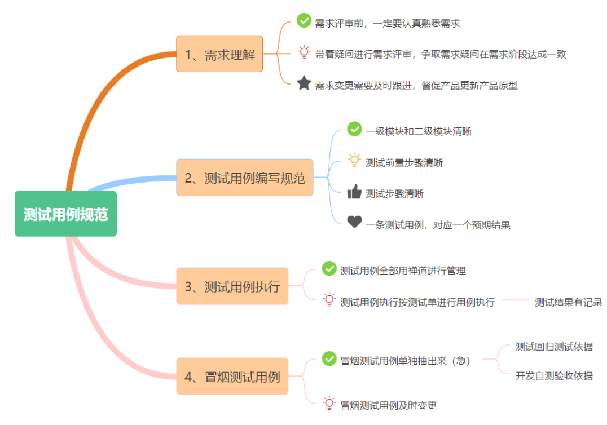

# 用例编写规范

## 引言

### 编写目的

本文档针对目前A同学写出的测试用例，B同学看不懂和没办法执行问题，建立统一的测试用例编写规范。提升测试用例通用性，做到任何一个同学在不懂需求的情况下，拿到测试用例都能顺利去执行和测试。

### 适用范围

适用于公司产品、项目类项目的测试用例编写管理，适用于质量部门的任意维度测试用例编写和执行。

## 测试用例规范

### 测试用例规范图

### 需求理解

:::info 内容

1. 需求的理解，争取在需求评审阶段达成
2. 搞清楚需求的输入和输出的是如何触发
3. 搞清楚输入框的边界值
4. 搞清楚字段的校验（正常是前后端都要做相应的校验）
5. 新增字段，对历史数据的影响，历史数据是否有相应的初始化手段保证（要不历史数据都是脏数据）
6. 需求的新增和改变，会影响到哪些功能和模块
7. 异常场景，是否有相应的处理机制

:::

### 需求变更

:::danger 内容

1. 需求变更后，产品需要及时更新需求文档和产品原型，UI也需要同步修改
2. 需求变更后，需要及时知会测试

:::

### 测试用例的编写规范

:::tip 内容

用例原则：一条测试用例，对应一个预期结果 【用例标题】 测试用例检查点描述

【前置条件】 1. 操作的网站地址. 用户名和密码（app就是相应的应用. 用户名和密码） 2. 进入目标页面的操作路径

【步骤】 触发预期结果的操作步骤

【预期结果】 1. 要是界面内容的检查，需要从左到右，从上到下，分层把内容用文字描述出来 2. 预期结果清晰无误

:::

### 冒烟测试用例

:::caution 内容

冒烟测试用例，需要单独出来，作用有两点： 1. 回归测试的依据 2. 开发自测的依据 冒烟测试需要及时更新，保证冒烟测试跟系统的更新是同步. 一致。

:::

### 测试用例执行

:::tip 内容

测试用例管理：禅道 测试用例编写模板：禅道用例模板 测试用例执行：禅道建相应版本的测试单

:::
