# Jmeter数据可视化展示

## 1、influxdb安装与操作

### 1.1、安装

https://portal.influxdata.com/downloads/ 可以从官网获取最新版本 办法一： wget https://dl.influxdata.com/influxdb/releases/influxdb-1.8.4.x86\_64.rpm sudo yum localinstall influxdb-1.8.4.x86\_64.rpm  
systemctl enable influxdb  
systemctl start influxdb  
systemctl status influxdb （查看 influxdb 状态）

### 1.2、操作

influx linux 命令行模式下进入数据库 show databases; #查看库 create database jmeter； #建jmeter库 use jmeter #使用该库 show measurements; 查看库下面的表 创建管理员权限的用户 CREATE USER "admin" WITH PASSWORD 'admin' WITH ALL PRIVILEGES; 1.3、配置 Jmeter使用graphite协议去写入数据到InfluxDB，因此，需要在InfluxDB配置文件启用它，如下 vi /etc/influxdb/influxdb.conf #修改以下配置  
\[\[graphite\]\]  
enabled = true  
bind-address = ":2003"  
database = "jmeter"  
retention-policy = ""  
protocol = "tcp"  
batch-size = 5000  
batch-pending = 10  
batch-timeout = "1s"  
consistency-level = "one"  
separator = "."  
udp-read-buffer = 0

## 2、grafana安装和使用

### 2.1、安装

http://docs.grafana.org/installation/ 安装方式可以参考官网 https://grafana.com/grafana/download 下载地址 wget https://dl.grafana.com/enterprise/release/grafana-enterprise-8.3.3-1.x86\_64.rpm #下载 granafa  
yum install grafana-enterprise-8.3.3-1.x86\_64.rpm #安装，遇到需要输入的直接 y 就 ok； systemctl start Grafana-server systemctl enable Grafana-server #启动 Grafana #/etc/Grafana/Grafana.ini 配置文件路径，一般保持默认配置即可。 #systemctl status firewalld.service 查看防火墙状态，防止出现其他干扰问题，最好关闭 登录访问 Grafana 访问：http://127.0.1.1:3000（ip 自行替换，3000 为默认端口） 默认账号/密码：admin/admin

### 2.2、操作

#### 2.2.1、新建jmeter-influxDB

点击首页的data source新建一个jmeter-influxdb的数据源 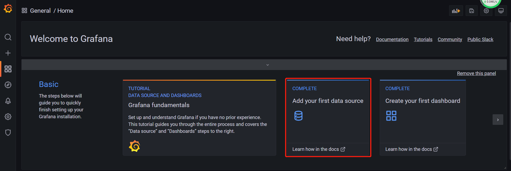 选中influxdb，进行双击 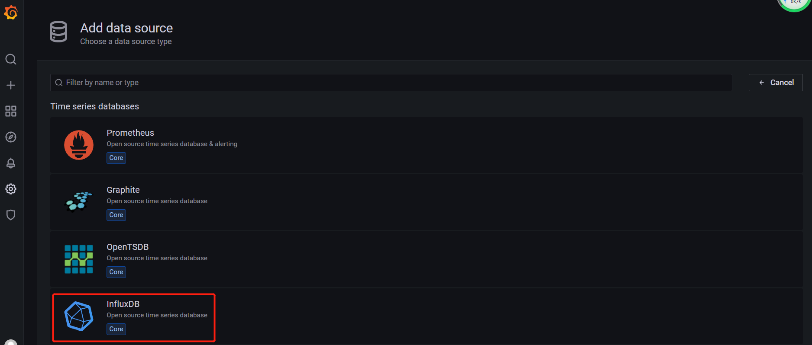 配置influxdb的地址，端口默认是8086，grafana和influxdb在同一个服务器，可以用localhost或者具体ip 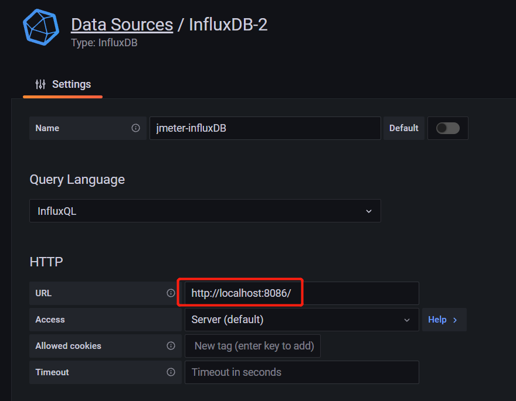 influxdb数据库默认是不需要用户名和密码，也可以修改配置需要用户名和密码验证 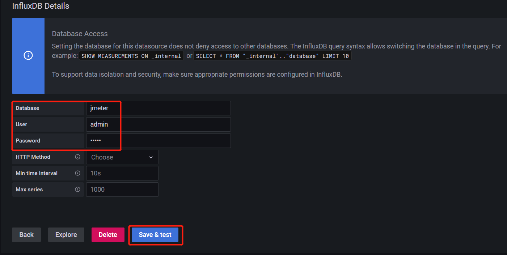

#### 2.2.2、新建jmeter-dashboard

进入https://grafana.com/grafana/dashboards该页面进行搜索jmeter可以找到很多jmeter的dashboard模板，选择一个进行复制 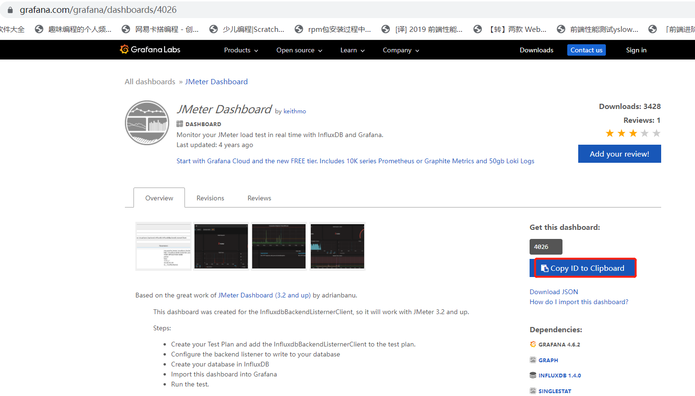 回到grafana页面，点击+到点击import,进行导入模板 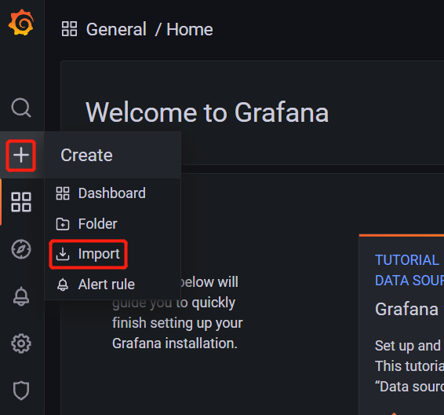 粘贴模板id，点击load进行加载 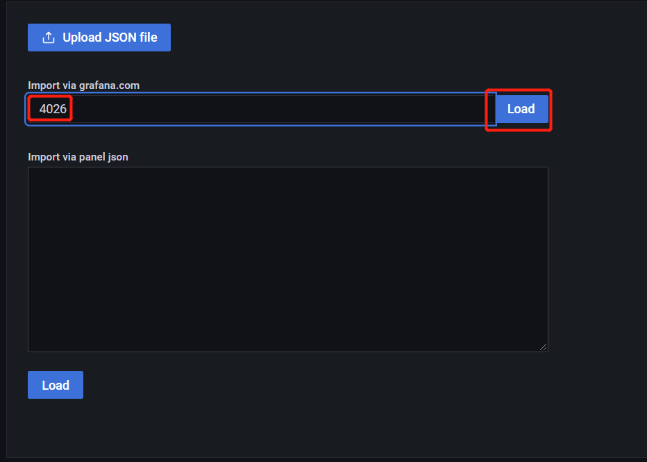 命名和选择数据源，其他参数保持不变，点击import按钮进行导入 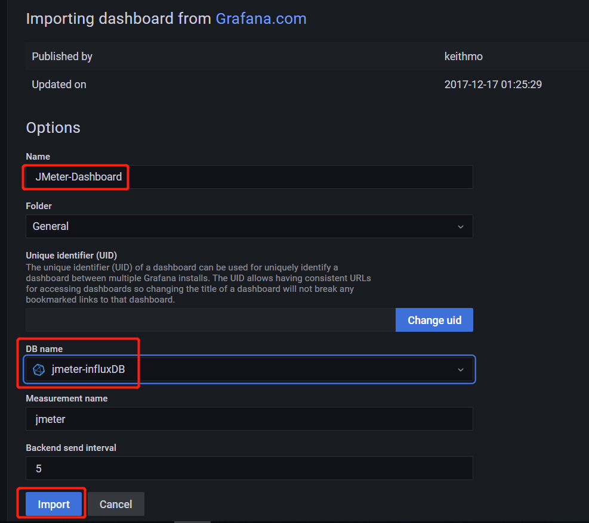 配置成功后，可以看到下面的界面 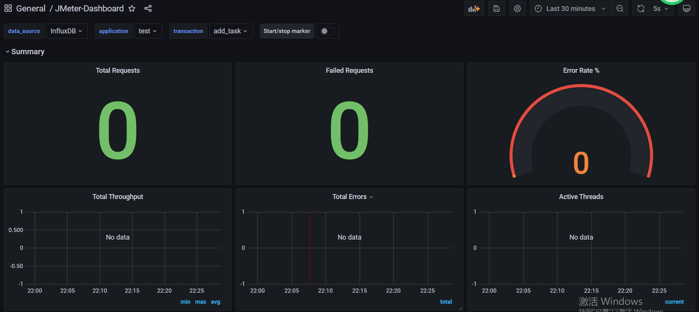

## 3、jmeter

添加后端监听器（ Backend Listener） 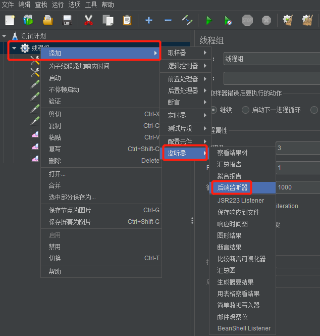 配置参数如下图 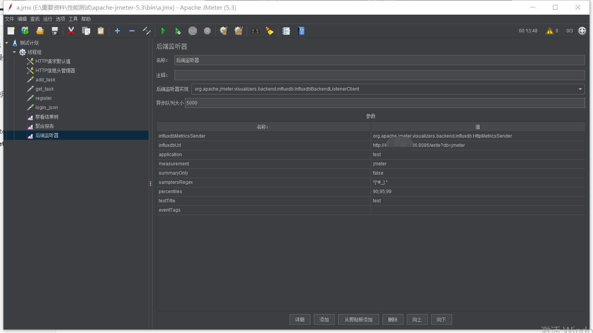 添加一个http请求，直接get一下https://www.baidu.com就可以从grafana上面实时看到数据
